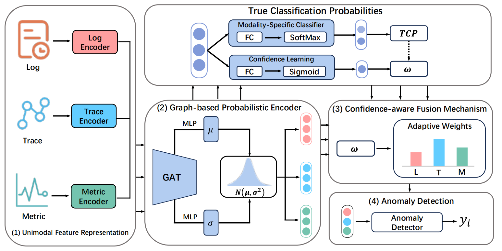

# Uncertainty-Aware Multimodal Anomaly Detection
# for Microservice Systems with Active Learning

### Architecture



​        The above figure presents an overview of the MUAD framework , a multimodal anomaly detector integrated with an active learning strategy. The framework operates in an iterative training paradigm, wherein human annotators label the most informative samples and high-confidence predictions are automatically assigned pseudo-labels to expand the annotated dataset.Within a given query budget, the model aims to maximize detection performance. During each iteration, MUAD adopts the approach illustrated in Figure 5 to jointly model both intra-modal and inter-modal uncertainties, thereby ensuring the detector’s performance and robustness. Specifically, modality specific encoders are first applied to process inputs from different data sources. To capture intra-modal uncertainty, a Graph-based Probabilistic Encoder (GPE) is employed to represent input features as Gaussian distributions. Subsequently,a Confidence-aware Fusion Mechanism (CFM) is designed to adaptively assign fusion weights to each modality. The final fused representation is then forwarded to the anomaly detector for prediction

###  Environment

The repository has some important dependencies below

- Python 3.8
- Pytorch 1.12.0


###  Dataset

The publicly available dataset used in this paper, named socialnetwork, can be downloaded from [https://doi.org/10.5281/zenodo.7615393](https://doi.org/10.5281/zenodo.7615393).

The other dataset that we don't have a permission to publish

The downloaded datasets can be put in the 'data' directory. The directory structure looks like:

```
${CODE_ROOT}
    ......
    |-- Dataset
        |-- chunk
            
```


### Project structure

```
MUAD/
├── configs/                  # Configuration files
│   └── params.json           # Model parameter configuration
├── data/                     # Data loading and preprocessing
│   ├── __init__.py
│   ├── dataset.py            # Dataset class definitions
│   └── utils.py              # Data processing utilities
├── models/                   # Model definitions
│   ├── __init__.py
│   ├── encoders.py           # Multimodal encoders
│   ├── graph_model.py        # Graph neural network components
│   ├── layers.py             # Basic network layers
│   └── main_model.py         # Main model integration
├── training/                 # Training-related components
│   ├── __init__.py
│   └── base_model.py         # Base training framework
├── active_learning/          # Active learning module
│   ├── __init__.py
│   └── strategies.py         # Active learning strategies
├── utils/                    # Utility functions
│   ├── __init__.py
│   ├── general_utils.py      # General-purpose utilities
│   └── logging_utils.py      # Logging utilities
├── main.py                   # Main entry point
└── README.md                 # Project documentation

```

###  Training

The instructions for running model MUAD are as follows.

```python
python main.py
```


